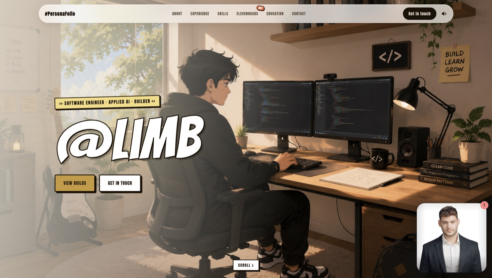

<p align="center">
  
</p>

# PersonaFolio (Conversational AI Portfolio)

**Don't read a portfolio — talk to it. A manga-styled avatar of me answers questions and drives the page by voice: it scrolls to the right section, opens a project, and explains it. Powered by D-ID and ElevenLabs.**

> Built for ElevenHacks 2026 (ElevenLabs + D-ID).

[](https://personafolio-limb.vercel.app/)
[](https://www.d-id.com/)
[](https://elevenlabs.io)
[](https://vuejs.org)
[](https://vitejs.dev)
[](https://gsap.com)
[](https://vercel.com)
[](https://elevenlabs.io)

> A portfolio is a stack of static pages a recruiter skims and forgets. A résumé can't answer a follow-up.
>
> **PersonaFolio turns the portfolio into a conversation.** Ask the avatar anything — my background, a specific skill, a project's internals, how to reach me — and it walks you there on screen and answers in the first person. The avatar isn't decoration bolted on; voice-driven navigation is the interface.

---

## Table of Contents

- [What is PersonaFolio?](#what-is-personafolio)
- [How It Works](#how-it-works)
- [The Avatar (D-ID + ElevenLabs)](#the-avatar-d-id--elevenlabs)
- [Key Features](#key-features)
- [Design](#design)
- [Tech Stack](#tech-stack)
- [Running Locally](#running-locally)
- [The Agent (bootstrap)](#the-agent-bootstrap)
- [Deploy](#deploy)
- [License](#license)

---

## What is PersonaFolio?

A single-page, manga-styled portfolio with a talking avatar embedded in the corner. Six sections —
About, Experience, Skills, ElevenHacks, Education, Contact — plus a standalone page for each of the
eleven ElevenHacks builds. Everything is navigable two ways:

- **By hand** — scroll, click the nav, open a project card.
- **By voice** — talk to the avatar. It calls client tools to scroll to a section, open a project,
  or go home, then explains what's on screen — confidently, in the first person.

The site works fully without the avatar (the embed is skipped if unconfigured); the avatar is the
headline experience on top.

---

## How It Works

```
You speak → D-ID avatar (ElevenLabs voice) → its LLM decides to navigate
  → emits a client tool call → forwarded through the D-ID embed
  → registerClientTool handler in the browser (useDidAgent.ts)
  → useRoute: smooth-scroll to the section / open the project / go home
  → the avatar then explains, grounded on its knowledge base
```

1. **Ask** — "tell me about yourself", "your MLOps experience", "walk me through Beacon", "how do I connect?"
2. **Navigate** — the avatar silently calls `scroll_to_section`, `open_project`, or `go_home`; the page moves.
3. **Answer** — it speaks in the first person from a baked-in knowledge base of my background and every project.

---

## The Avatar (D-ID + ElevenLabs)

- **D-ID Agents embed** (`agent.d-id.com/v2/index.js`) renders an **Expressive** avatar with an
  ElevenLabs voice. (Expressive presenters are required for tool-calling — the talk/photo pipeline
  can't invoke client tools.)
- **Client tools** registered in-browser via `window.DID_AGENTS_API.functions.registerClientTool`:
  | Tool | Action |
  |------|--------|
  | `scroll_to_section({ section_id })` | scroll to `about` · `experience` · `skills` · `elevenhacks` · `education` · `contact` |
  | `open_project({ slug })` | open a project's page for a deep dive |
  | `go_home()` | back to the top |
- Handlers are pure navigation through `useRoute`, returning the `{ success }` JSON-string contract;
  in dev they're exposed at `window.__didTools` for testing.
- Persona + behavior live in `agent/prompts/prompt.md`; the project knowledge is baked into the
  prompt (and mirrored in `agent/prompts/knowledge-base.txt`).

---

## Key Features

| Feature | Description |
|---------|-------------|
| **Voice-driven navigation** | The avatar moves the page itself — scroll to any section, open any of 11 projects, go home — then explains. |
| **Interview-a-portrait persona** | First-person, confident, concise; greets once, never reintroduces; never narrates the navigation. |
| **Standalone project pages** | Each ElevenHacks build is its own deep-link page (`/project/<slug>`), image + write-up. |
| **URL routing** | Hand-rolled History API: `/about`, `/elevenhacks`, `/project/<slug>` — deep-linkable and shareable; URL changes only on explicit navigation, not while scrolling. |
| **Manga design system** | Bangers display titles, Comic Neue body, comic panels, sticky-note labels, warm palette; full-bleed scene backgrounds; a dark-gold hologram About page. |
| **Ambient audio** | Low background music + click SFX with a mute toggle; everything honors `prefers-reduced-motion`. |
| **Custom cursor** | Golden cursor with a fading code trail. |
| **Graceful degrade** | No avatar credentials? The embed is skipped and the site runs normally. |

---

## Design

A deliberate manga/anime aesthetic — not a generic AI-slop gradient deck:

- **Type:** Bangers for titles (with comic stroke + hard-shadow pop), Comic Neue for body, condensed
  caps for labels.
- **Surfaces:** warm "liquid-glass" panels, comic-panel buttons with hard offset shadows, sticky-note
  tags, halftone/speed-line accents.
- **Scenes:** full-bleed illustrated backgrounds on the hero and contact; a gold "hologram HUD"
  About page with connector callouts.
- **Motion:** GSAP + ScrollTrigger reveals, a pinned hero→About cross-dissolve, Lenis smooth scroll.

---

## Tech Stack

| Category | Technology |
|----------|-----------|
| **Framework** | Vue 3.5 + Vite 7 + TypeScript |
| **Styling** | SCSS with design tokens (`tokens.scss`), auto-injected mixins |
| **Motion** | GSAP + ScrollTrigger, Lenis smooth scroll |
| **Avatar** | D-ID Agents v2 embed — Expressive presenter, client tools |
| **Voice + reasoning** | ElevenLabs voice via D-ID; OpenAI `gpt-4.1` (hosted by D-ID), knowledge-grounded |
| **Audio** | HTML5 Audio — ambient track + click SFX |
| **Routing** | Hand-rolled History API (sections + `/project/<slug>`) |
| **Deploy** | Vercel (static Vite build + SPA rewrites) |
| **Agent tooling** | `tsx` bootstrap scripts against the D-ID REST API |

---

## Running Locally

### Prerequisites
- Node 20+
- (Optional, for the avatar) a D-ID account + API key

### Install & run
```bash
npm install
cp .env.example .env.local   # optional — fill VITE_DID_* to enable the avatar
npm run dev                  # http://localhost:3000   (or ./start.sh)
```

`start.sh` frees the port and boots the dev server. Without `VITE_DID_*` the site runs fine; the
avatar widget is simply skipped.

### Scripts
| Command | Description |
| --- | --- |
| `npm run dev` | Dev server on port **3000** |
| `npm run build` | Typecheck + production build to `dist/` |
| `npm run preview` | Serve the production build |
| `npm run bootstrap:agent` | Configure the D-ID agent (tools + prompt + client key) |
| `npm run bootstrap:elevenlabs` | Bootstrap an ElevenLabs agent |

---

## The Agent (bootstrap)

The avatar's tools, prompt, and client key are provisioned via the D-ID REST API:

```bash
# Configure an existing agent (keeps its avatar/voice); mints a localhost-scoped client key:
DID_AGENT_ID=v2_agt_xxxx npm run bootstrap:agent
```

- `agent/prompts/prompt.md` — the system prompt (persona, tools, routing, baked knowledge).
- `agent/prompts/knowledge-base.txt` — the knowledge document (upload to the D-ID knowledge base).
- `agent/tools.json` — the three client-tool schemas.

> **Note:** tool-calling requires an **Expressive** presenter. Custom-photo ("talk") avatars render
> and speak but never invoke tools.

The `agent/` folder is gitignored (private).

---

## Deploy

| Layer | Host | Config |
|---|---|---|
| Frontend | **Vercel** — [personafolio-limb.vercel.app](https://personafolio-limb.vercel.app/) | Framework Vite, build `npm run build`, output `dist`, SPA rewrites in `vercel.json` |
| Avatar | **D-ID** | Expressive agent; client key's `allowed_domains` must include the deploy origin |

**Environment variables** (Vercel → Production + Preview; baked at build time):
```env
VITE_DID_AGENT_ID=v2_agt_...
VITE_DID_CLIENT_KEY=ck_...        # must be scoped to the deploy domain
```

Mint a domain-scoped client key for the deploy origin:
```bash
DID_AGENT_ID=v2_agt_xxxx npx tsx --env-file=.env scripts/client-key.ts https://your-domain http://localhost:3000
```

---

## License

<p>
  <a href="https://opensource.org/licenses/MIT">
    
  </a>
</p>

Licensed under the [MIT License](https://opensource.org/licenses/MIT).

Built by [Limb](https://x.com/__padmanabhan) for ElevenHacks 2026.
